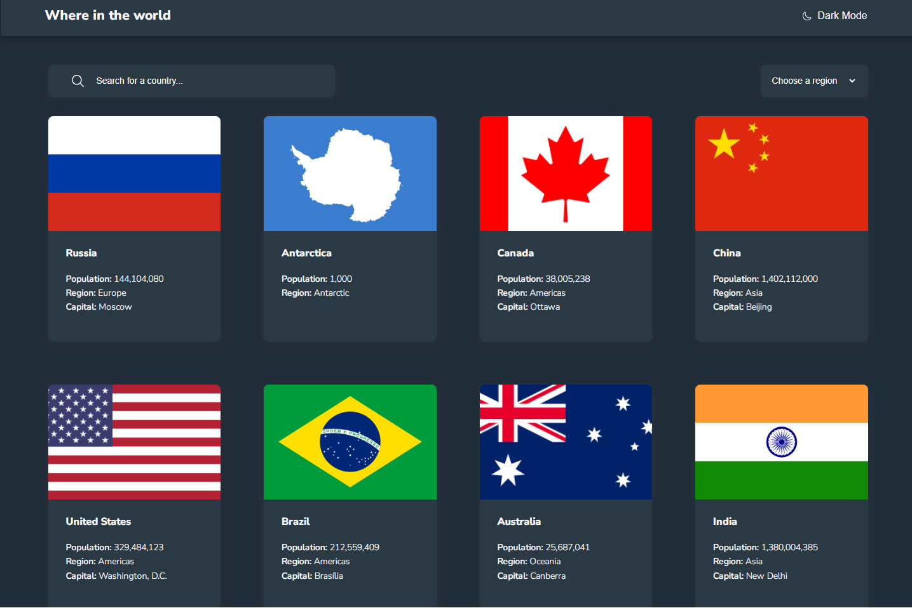
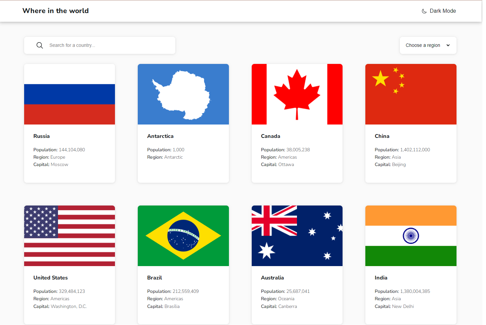
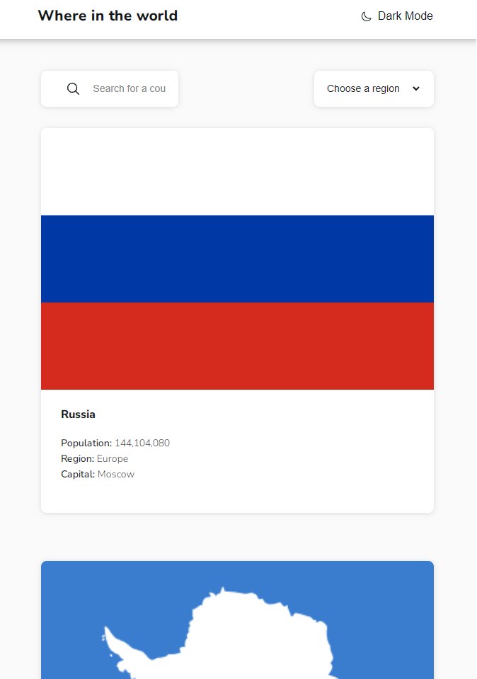
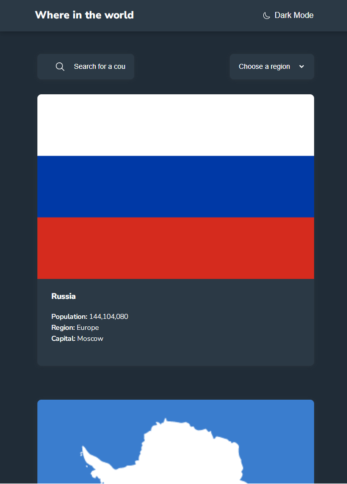

# Frontend Mentor - REST Countries API with color theme switcher solution

This is a solution to the [REST Countries API with color theme switcher challenge on Frontend Mentor](https://www.frontendmentor.io/challenges/rest-countries-api-with-color-theme-switcher-5cacc469fec04111f7b848ca). Frontend Mentor challenges help you improve your coding skills by building realistic projects. 

## Table of contents

- [Overview](#overview)
  - [The challenge](#the-challenge)
  - [Screenshot](#screenshot)
  - [Links](#links)
- [My process](#my-process)
  - [Built with](#built-with)
  - [What I learned](#what-i-learned)
  - [Continued development](#continued-development)
  - [Useful resources](#useful-resources)
- [Author](#author)
- [Acknowledgments](#acknowledgments)

**Note: Delete this note and update the table of contents based on what sections you keep.**

## Overview

### The challenge

Users should be able to:

- See all countries from the API on the homepage
- Search for a country using an `input` field
- Filter countries by region
- Click on a country to see more detailed information on a separate page
- Click through to the border countries on the detail page
- Toggle the color scheme between light and dark mode *(optional)*

### Screenshot

### Links

- Live Site URL: [Netlify](https://imaginative-puffpuff-bdb744.netlify.app/)
- Solution URL: [Github](https://github.com/DaedalusHatak/rest-countries)

## My process

### Built with

- Semantic HTML5 markup
- SCSS custom properties
- VUE.js
- Mobile-first workflow

### What I learned
I learned how to get data from API, how to create simple theme-switcher and how to get data based on choosed country and its border countries.

### Continued development

I would like to update options in select tag, but this API will soon be off

### Useful resources

## Author

- Website - [Paweł Kiciński](http://pawel-kicinski.pl)
- Github - [DaedalusHatak](https://github.com/DaedalusHatal)
- Frontend Mentor - [@DaedalusHatak](https://www.frontendmentor.io/profile/DaedalusHatak)

## Acknowledgments

I asked for help on discord server Vue.js Poland with some minor changes

